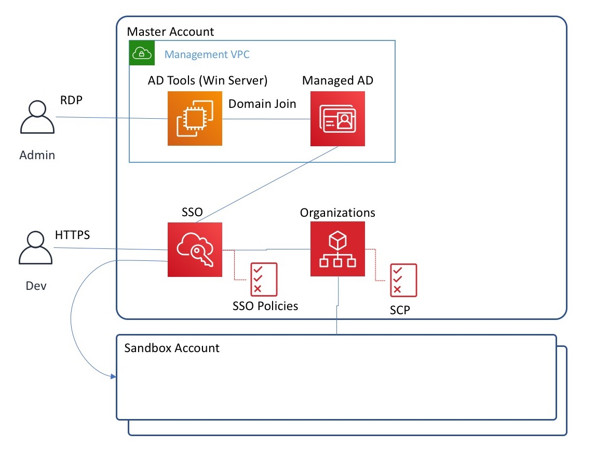

# AWS Multi Account Setup 

Scripts to enable management of a multi-account envioronment. 
The main purpose of these tools are to manage student accounts for workshops.

## Design

 

## Scripts

### PowerShell scripts for Active Directory user management.

**[./powershell/SetPassword.ps1](./powershell/SetPassword.ps1)**: Resets Active Directory user passwords. Run from the AD Tools Windows Server.

### Sample Service control policies (SCP) for AWS Organizations.

**[./update-scp.py](./update-scp.py)**: synchronizes SCP for the Organization from local SCP files.      

**[./scp](./scp)**: directory containing SCP json files.

### Sample Permissions Policies for AWS Single Sign-on. 

**[./sso]()**: directory containing AWS SSO Permissions Policies, requires copy-paste into the SSO console manually, since the SSO API is currently not available. 

## Cleaning up accounts

After a workshop, cleanup resources created in sandbox accounts to prepare them for reuse. 

### aws-nuke 

This is the preferred way to cleanup after most workshops. 

See [https://github.com/rebuy-de/aws-nuke]()

### Account Cleaner (data engineering)

Yet another utility to nuke resources from AWS accounts. Does not support many resource types. This was designed to only cleanup resources from a Data Engineering workshop, such as DMS, Glue, Athena. While aws-nuke is the preferred tool, during 2018 it did not fully-support these resources.

Because resource dependencies may require time to be deleted, you may encounter errors while deleting resources with dependencies. If this happens, pause for awhile to let the dependencies delete, then re-run the script.

  * **[./account-cleaner/nuke-resources.py]()**: Cleanup DMS, Glue, S3, CloudFormation templates for the data engineering workshop. 
    Requires short term STS creds environment variables to be set for each account to be cleaned-up.

